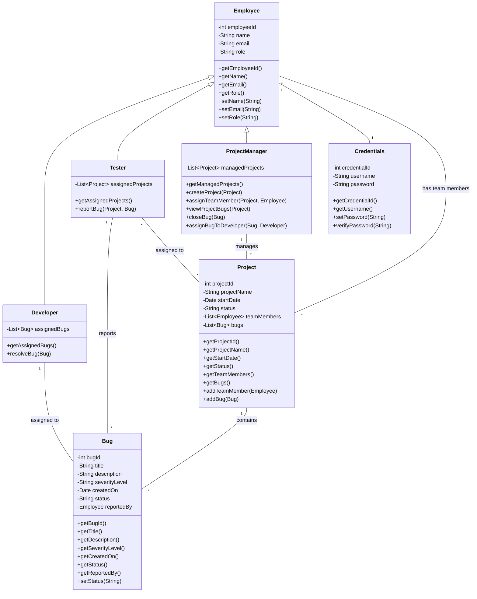

# CODEFURY-DA3-HYD-TEAM4
Bug Tracking System developed under CoderFury Competition 2024.

## UML

## Team Members
    1. Dayala Siddartha Naidu (Team Lead)
    2. Mohammad Kashif
    3. Shantanu Dash
    4. Maddirala Sai Srinivas Sujan
    5. Agampreet Kaur
    6. Preeti Poddar